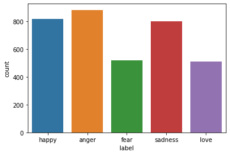
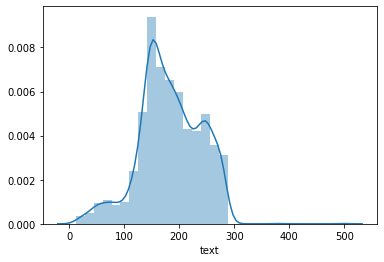
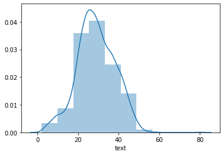

<h1 align="center">Emotion detection in tweets using Bidirectional LSTM
with CNN</h1>
<h3>Abstract</h3>

Emotion detection is one of the branches of text analysis. It deals with detection of sentiment
analysis and extraction of emotions. With increasing involvement of human beings on social
media sites it has become evident to recognise emotions involved in tweets to avoid abusive
tweets. People nowadays use social media sites for abusive tweets. If we can detect such
emotions then we can prevent the people from posting them on social media. Since emotions
play an important part in human life, therefore tweets and messages will continue to have
such emotions. But we can detect use of machine learning and NLP for detection of any tweet
which shows anger and the user can be asked to modify it into a normal sentence.
Exaggerated emotional tweets can sometimes be very harmful as they can insight riots, or we
can stop any suicidal message having emotions of fear sadness to prevent suicide etc. In the
current project, the aim is to detect emotions in tweets such as love, sadness, fear, anger and
happiness using Bidirectional LSTM with CNN.  

  
<h3>Method</h3>
<h4>Dataset</h4>

For emotion classification in tweets we are using 
<a href="https://github.com/indobenchmark/indonlu">IndoNLU</a>. <a href="https://github.com/indobenchmark/indonlu">IndoNLU</a> is a collection of
Natural Language Understanding (NLU) resources from Bahasa Indonesia with 12 downstream
tasks. They provide the code to reproduce the results and large pre-trained models (​ IndoBERT
and ​ IndoBERT-lite​ ) trained with around 4 billion word corpus (​ Indo4B​ ), more than 20 GB
of text data. This project was initially started by a joint collaboration between universities and
industry, such as Institut Teknologi Bandung, Universitas Multimedia Nusantara, The Hong
Kong University of Science and Technology, Universitas Indonesia, Gojek, and Prosa.AI.

The tweets data csv files are available in the <a href="https://github.com/indobenchmark/indonlu/tree/master/dataset/emot_emotion-twitter">IndoNLU/emot_emotion-twitter<a> repository. The
repository proves two csvs train_preprocess.csv and valid_preprocess.csv. The below table [1]
shows the gist of the dataset. The csv consists of two columns “label” and “text”. The “label”
consists of emotions values represented by the tweets in the text column. Both training and
validation dataset consists of 3521 twitter text. Figure 1. shows the bar graph with counts of
the tweets with different counts of emotion labels. The distribution of ‘anger’, ‘sadness’ and
‘happy’ emotions is the maximum in the corpus. Figure 2 and Figure 3 shows the univariate
distribution plot. It is used basically for a univariant set of observations and visualizes it
through a histogram i.e. only one observation and hence we choose one particular column of
the dataset. Figure 2 depicts the distribution showing the length of the tweets in the corpus.
While Figure 3 shows the distribution showing the word count of the tweets in the corpus.
 

  
 <figure style="text-align: center;">
    
    <figcaption>Table 1. Table shows train dataset with label and text column.</figcaption>
</figure>

 <figure style="text-align: center;">
    
    <figcaption>Figure 1. Bar graph showing the counts of the tweets with different emotions in the corpus</figcaption>
</figure>

 <figure style="text-align: center;">
    
    <figcaption>Figure 2. Distribution showing the length of the tweets in the corpus</figcaption>
</figure>

 <figure style="text-align: center;">
    
    <figcaption>Figure 3. Distribution showing the word count of the tweets in the corpus</figcaption>
</figure>
